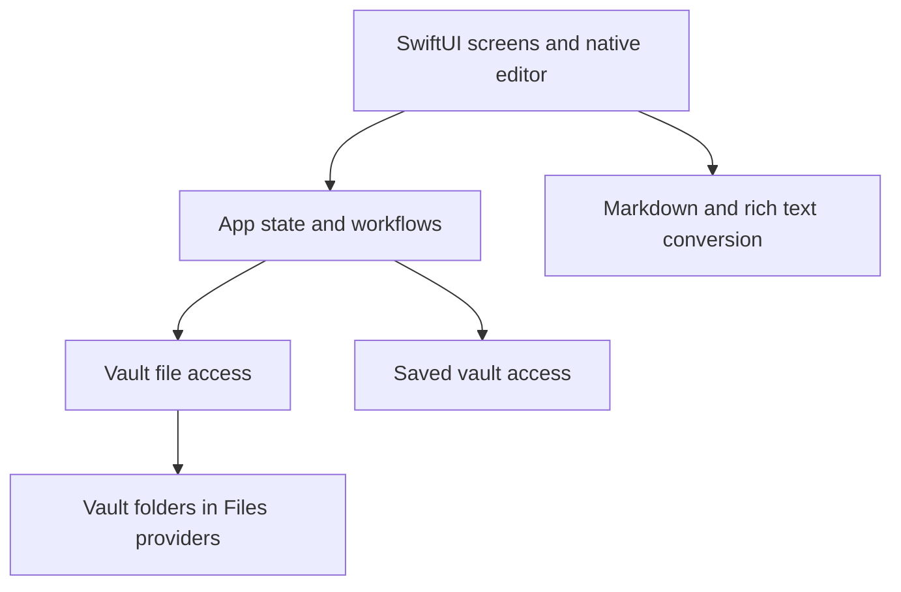

# Flint

Flint is a native SwiftUI markdown note-taking app built around user-selected vault folders in Files providers such as local storage and Dropbox.


Strike a spark. Keep every note in a markdown vault you own.

## Scope and specifications

Flint lets you create or open a markdown vault in Files, organize your notes, and write with autosave. Notes and their images stay in folders you control, while Flint manages access to the vault and restores your editing session.

The [OpenSpec specifications](openspec/specs/) are the source of truth for current behavior. Update the relevant spec before changing the app; proposals and implementation plans live in [OpenSpec changes](openspec/changes/).

## Shared language

Start with the [glossary](GLOSSARY.md) for common terms and the [domain model](docs/domain-model.md) for how notes, files, images, and recovery relate.

## Architecture



The screens and editor handle browsing and writing. App state coordinates opening vaults, loading notes, and saving edits. Document conversion translates between the editor's rich text and markdown files, including images. Vault file access reads and writes those files through the selected Files provider, while saved bookmarks let Flint reopen the vault on later launches.

## Signing

The repo uses `Configs/Local.xcconfig` for local-only signing overrides. The example file in `Configs/Local.xcconfig.example` shows the expected key. Contributors can create their own local override without committing team-specific settings.

## Testing

GitHub Actions builds Flint and runs the full unit and UI test suite on pushes to `main` and pull requests targeting `main`. You can also start **iOS CI** manually from the Actions tab. CI selects an available iPhone simulator and uploads an Xcode test result bundle as the `flint-test-results` artifact, retained for 14 days.

Run the required automated suite on a simulator by default:

```bash
DEVELOPER_DIR=/Applications/Xcode.app/Contents/Developer \
xcodebuild \
  -project Flint.xcodeproj \
  -scheme Flint \
  -destination 'platform=iOS Simulator,name=iPhone 17' \
  -derivedDataPath /tmp/flint-derived-data \
  test
```

If that simulator is unavailable on your machine, use another available iOS Simulator destination.

For additional device validation, configure `Configs/Local.xcconfig` locally and run a physical-device test destination with `-allowProvisioningUpdates`.
