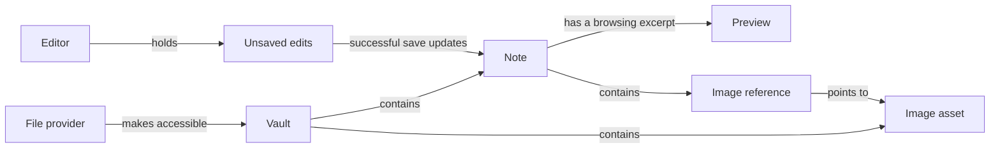

# How Flint's main concepts fit together

Flint lets a person edit Markdown notes in a folder they own. That folder is a **vault**. A file provider such as Dropbox makes the vault accessible through Files. The [glossary](../GLOSSARY.md) defines the terms used here and in specifications.

## Notes belong to a vault

A vault can contain subfolders. A note's location within the vault distinguishes it from another note with the same filename. The active vault is the one currently shown to the user; an old file operation may still be finishing for a previously opened vault.

A preview is an excerpt for browsing, not the full note and not proof of a successful save. The editor holds working text. A save confirms that a particular version of that text was written to the note file.

## Seeing a file does not mean its contents are ready

A provider can show a note's filename before it has finished downloading the contents. File details and file contents therefore describe different things. “Listed,” “downloaded,” and “available” are separate facts rather than a guaranteed sequence: a downloaded file can still be unreadable because access has been lost.

For example, a Dropbox note can appear in the list while opening it still waits for the provider. That does not mean the note is empty. A failure to read it must not turn into an empty saved note.

Flint reads and writes files through the provider. This model does not introduce a separate Flint cloud account, sync engine, or copy of the whole vault.

## Images have their own files

An image reference is part of a note's Markdown; the image asset is a separate file. A note can reference an image elsewhere in the vault, and several notes can reference the same asset. Removing one reference does not establish that the asset is unused.

When an image is imported, the source image and the vault's imported copy are different files. The note should reference the vault copy after the import succeeds.

## Troubleshooting records are separate from note content

A debug log records what Flint was doing and what failed. A crash report supplies evidence about an unexpected app termination. Neither is a saved note or a recovery copy of the user's edits.

An interrupted opening is not proof of a crash: the user may have closed the app or iOS may have stopped it. Recovery needs to account for that uncertainty. A freeze, where Flint remains open but stops responding, is also different from a crash.

A recovery copy preserves unsaved text separately from the original note. It must not be confused with a debug log or permission to overwrite the original file.

## Current behavior and proposed improvements

The existing code represents vaults, note locations, previews, image references, and imported image assets. The editor tracks unsaved changes and saves notes. These concepts can be checked in [Models.swift](../Flint/Models.swift), [AppModel.swift](../Flint/ViewModels/AppModel.swift), and [VaultFileService.swift](../Flint/Services/VaultFileService.swift).

The following are proposed improvements, not claims about functionality already implemented:

- [Debug logs](https://github.com/lukeryannetnz/flint-ios/pull/15) and [crash information and recovery](https://github.com/lukeryannetnz/flint-ios/pull/16).
- [Responsive file access](https://github.com/lukeryannetnz/flint-ios/pull/17), [gradual note loading and safe saves](https://github.com/lukeryannetnz/flint-ios/pull/18), and [background image loading](https://github.com/lukeryannetnz/flint-ios/pull/19).

Those specifications define the actual limits and acceptance criteria. For example, if version A finishes saving after the user has typed version B, confirming A must not mark B as saved. The glossary provides the names for these concepts; it does not replace their specifications.

Use this language in new specifications and PR descriptions. Existing paths or code identifiers such as `diagnostic-journal` can remain stable while reader-facing prose says **debug log**.
